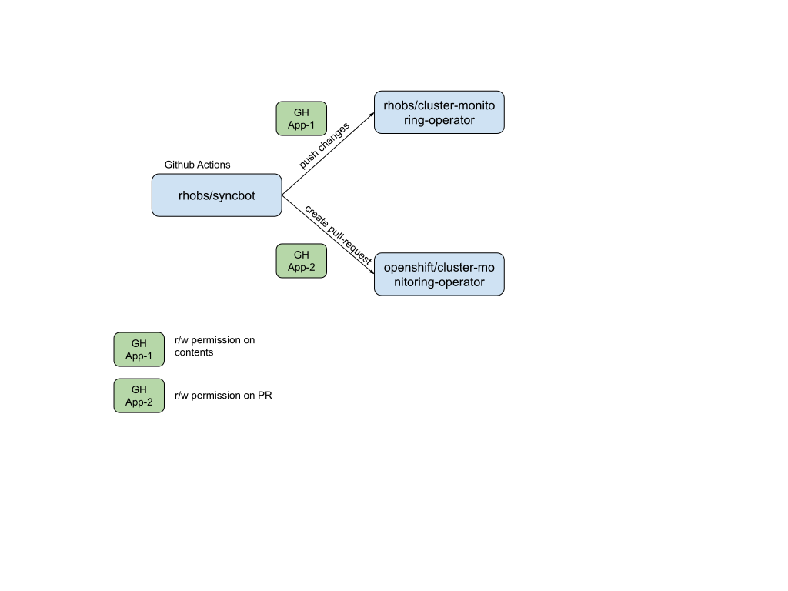

# Syncbot

Workflows to automate Openshift monitoring dependency upgrades.

## Introduction
Cluster Monitoring Operator relies on various upstream components to fulfill the monitoring needs for Openshift. [Here is a list](https://github.com/openshift/cluster-monitoring-operator/blob/main/jsonnet/versions.yaml) of those components,

- [prometheus](https://github.com/openshift/prometheus)
- [prometheus-alertmanager](https://github.com/openshift/prometheus-alertmanager)
- [prometheus-operator](https://github.com/openshift/prometheus-operator)
- [thanos](https://github.com/openshift/thanos)
- [node_exporter](https://github.com/openshift/node_exporter)
- [kube-state-metrics](https://github.com/openshift/kube-state-metrics)
- [kubernetes-metrics-server](https://github.com/openshift/kubernetes-metrics-server)
- [prom-label-proxy](https://github.com/openshift/prom-label-proxy)
- [kube_rbac_proxy(auth team handles it)](https://github.com/openshift/kube-rbac-proxy)
- [grafana (deprecated)](https://github.com/openshift/grafana)

Since those components are shipped as part of the Openshift release payload, it must be built using Openshift build jobs (OSBS), which requires customization to build scripts. To accomplish this, the Monitoring team maintains a fork of all those components under openshift github org.

## Downstream Changes

The forks are almost the same as the upstream repo with the following additional changes,

1. Master/Main branch pointing to upstream latest release rather than upstream Master/Main
2. Vendors go mod packages to enable air gapped builds
3. Custom Dockerfile to use Openshift build system provided base image
4. Makefile changes to enable unit & e2e tests
5. OWNERS file changes
6. .gitignore changes to allow vendor directory
7. UI assets gobin file - assets_vfsdata.go(prometheus, alertmanager, grafana)

# Problem Statement
The workflow we have currently for synchronizing our downstream forks and CMO with upstream relies heavily on manual intervention. It is also tedious because we tend to bump all projects at the same time which makes it harder to detect regressions and it requires bigger changes than expected in the jsonnet code sometimes.

https://issues.redhat.com/browse/MON-1856

# Prior Art

There is a tool named [merge-bot](https://github.com/shiftstack/merge-bot) from #forum-shiftstack, which updates [openshift/cloud-provider-openstack](https://github.com/openshift/clould-provider-openstack) and [openshift/csi-driver-nfs](https://github.com/openshift/csi-driver-nfs) repo from the respective upstream.

[https://prow.ci.openshift.org/?type=periodic&job=*merge-bot*](https://prow.ci.openshift.org/?type=periodic&job=*merge-bot*)

Here is a sample PR created by the merge bot: [csi-driver-nfs/pull#53](https://github.com/openshift/csi-driver-nfs/pull/53)

Another tool named rebasebot which is a fork of merge-bot with additional rebase features with a simple development workflow.

[https://prow.ci.openshift.org/?type=periodic&job=*rebasebot*](https://prow.ci.openshift.org/?type=periodic&job=*rebasebot*)

Here is a sample PR created by the rebase bot: [cloud-provider-gcp/pull/6](https://github.com/openshift/cloud-provider-gcp/pull/6)

# Using Github Actions

Initially we thought of using prow CI, however it was quite difficult to bring up the entire GH PR workflow into prow CI. However, Github Actions has plenty of [pre-built](https://github.com/peter-evans/create-pull-request) actions from the marketplace and it is quite easy to reuse for our use cases.

## Orchestration using Github Action

## Github App based Auth flow

The workflow makes uses of Github Apps based credential mode to interact with Github services.
The following applications must be created,

### [Cloner application](https://github.com/apps/monitoring-commit-bot)
This should be installed in the intermediate GitHub organization(for example [rhobs](https://github.com/rhobs)) with the permissions as follows:

- Contents: Read & Write
- Metadata: Read-only
- Workflows: Read & Write

### [PR creation App](https://github.com/apps/openshift-monitoring-bot)
This should be installed in the [openshift](https://github.com/openshift) GitHub organization with the following permissions:

- Contents: Read
- Metadata: Read-only
- Pull requests: Read & Write

Here are instructions on how to [create](https://docs.github.com/en/developers/apps/building-github-apps/creating-a-github-app) and [install](https://docs.github.com/en/developers/apps/managing-github-apps/installing-github-apps) a GitHub application.

Credentials of the above-mentioned app will be stored as repo secrets and passed down to the automation workflow through the following env vars,
- APP_ID
- APP_PRIVATE_KEY
- CLONER_APP_ID
- CLONER_APP_PRIVATE_KEY
